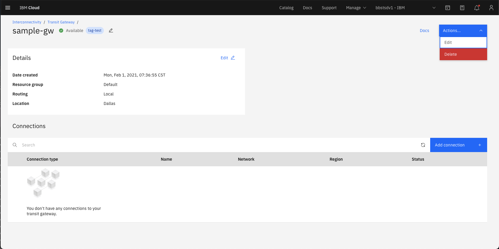

---

copyright:
  years: 2020
lastupdated: "2020-01-28"

keywords: transit, gateway, deleting

subcollection: transit-gateway

---

{:shortdesc: .shortdesc}
{:new_window: target="_blank_"}
{:codeblock: .codeblock}
{:pre: .pre}
{:screen: .screen}
{:tip: .tip}
{:note: .note}
{:important: .important}
{:download: .download}
{:external: target="_blank" .external}
{:term: .term}
{:help: data-hd-content-type='help'}
{:support: data-reuse='support'}

# Deleting a transit gateway
{: #delete-gateway}
{: help}
{: support}

To delete an {{site.data.keyword.tg_full}}, follow these steps.
{: shortdesc}

1. From your browser, open the [{{site.data.keyword.cloud_notm}} console](https://cloud.ibm.com){:external} and log in to your account.
2. Select the Menu icon  on the upper left of the page, then click **Hybrid Networking**.
3. Click **Transit Gateway**.
4. Click the name of the transit gateway you want to delete.

  If you are in the expanded view, click **View details**.
  {: tip}

5. Ensure the transit gateway has no attached connections - if it does, delete all connections.
  For each connection you want to delete, click the trashcan icon  next to it to delete.
6. After the connections are removed, you can delete the transit gateway. You can do this in two ways:
  * From the transit gateway's details page, click the Options menu icon  next to the gateway you want to delete and select **Delete**.
  
  * From an individual transit gateway page, select **Actions > Delete**.
  
